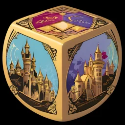
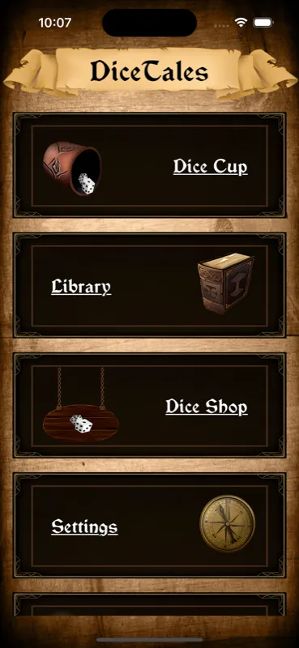
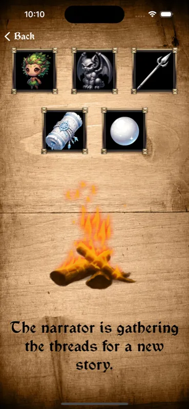

# ITROPICAL LIVE SOLUTIONS — Visual Upgrade Design Spec

**Version:** 1.0 · 2026-06-12
**Scope:** index.html, portfolio.html, dicetales.html, evanthium.html, markr.html, contact.html, header.html, styles.css
**Constraints honored:** plain HTML/CSS/JS, single `styles.css`, dark `#0b1220` base, `#ffd166` accent, card/tile concept kept, i18n via `data-i18n` untouched, header injection untouched, 640px mobile breakpoint, WCAG AA contrast, visible focus.

---

## 0. Design Direction (one sentence)

**"Tropical night sky":** deep navy surfaces with layered depth, a warm sunset gradient (`#ffd166 → #ff8c5a`) used sparingly for accents and glows, sharp modern display typography, and the existing tiles elevated with gradient borders and hover glow — premium dev-agency feel without losing the existing brand.

The single new design ingredient is the **sunset gradient** (yellow → coral). It echoes the Bali brand, gives the flat yellow accent a premium dimension, and is used in exactly four places: hero headline keyword, primary buttons, card hover borders, and section eyebrows. Everywhere else stays calm navy.

---

## 1. CSS Design Tokens

Replace the top of `styles.css` with this block. Every other rule in the file must reference tokens — no raw hex values below this point (exceptions: SVG data-URIs).

```css
:root {
  /* ── Surfaces (4 depth levels on the #0b1220 base) ── */
  --bg-0: #0b1220;            /* page background (UNCHANGED brand base) */
  --bg-1: #0f1830;            /* section tint / footer */
  --surface-1: #111c33;       /* card base */
  --surface-2: #16243f;       /* card hover / nested elements (badges, icon tiles) */
  --surface-3: #1d2e4f;       /* interactive secondary (buttons, lang switch) */

  /* ── Borders ── */
  --border-1: #243352;        /* default card/section borders */
  --border-2: #34487005;      /* DO NOT USE — see --border-strong */
  --border-strong: #344870;   /* hover borders on non-accent elements */

  /* ── Brand accents ── */
  --accent: #ffd166;          /* UNCHANGED brand yellow */
  --accent-strong: #ffdd85;   /* hover state of accent */
  --accent-2: #ff8c5a;        /* sunset coral — gradient partner ONLY, never alone on dark */
  --grad-sunset: linear-gradient(120deg, #ffd166 0%, #ff8c5a 100%);
  --grad-card-border: linear-gradient(160deg, rgba(255,209,102,.45), rgba(255,140,90,.12) 40%, rgba(36,51,82,.6) 75%);
  --accent-glow: rgba(255, 209, 102, .14);

  /* ── Text (all AA on --bg-0 and --surface-1) ── */
  --text-1: #eef2fa;          /* headings — 15.8:1 on bg-0 */
  --text-2: #c7d0e4;          /* body — 11.2:1 */
  --text-3: #93a1bd;          /* muted/captions — 6.1:1, AA-safe */
  --text-on-accent: #161616;  /* text on yellow buttons — 11.9:1 on #ffd166 */

  /* ── Typography ── */
  --font-display: "Space Grotesk", system-ui, sans-serif;
  --font-body: system-ui, -apple-system, "Segoe UI", Roboto, sans-serif;
  --fs-hero: clamp(2.1rem, 4.5vw + .5rem, 3.4rem);  /* h1 hero */
  --fs-h1: clamp(1.8rem, 3vw + .5rem, 2.5rem);       /* page h1 (app pages) */
  --fs-h2: clamp(1.35rem, 2vw + .4rem, 1.75rem);
  --fs-h3: 1.125rem;
  --fs-body: 1rem;
  --fs-lead: clamp(1.05rem, .6vw + .9rem, 1.25rem);
  --fs-small: .875rem;
  --fs-xs: .8125rem;
  --lh-tight: 1.15;
  --lh-body: 1.65;

  /* ── Spacing (4px base) ── */
  --sp-1: 4px;  --sp-2: 8px;  --sp-3: 12px;  --sp-4: 16px;
  --sp-5: 24px; --sp-6: 32px; --sp-7: 48px;  --sp-8: 64px; --sp-9: 96px;

  /* ── Radii ── */
  --r-sm: 8px;     /* badges, lang buttons */
  --r-md: 12px;    /* buttons, inputs */
  --r-lg: 16px;    /* cards */
  --r-xl: 24px;    /* hero panels, phone frames */
  --r-pill: 999px; /* eyebrows, tags */

  /* ── Shadows & glows ── */
  --shadow-card: 0 1px 2px rgba(0,0,0,.4), 0 8px 24px rgba(0,0,0,.35);
  --shadow-card-hover: 0 2px 4px rgba(0,0,0,.4), 0 16px 40px rgba(0,0,0,.45), 0 0 32px var(--accent-glow);
  --shadow-btn-primary: 0 4px 20px rgba(255, 209, 102, .25);
  --shadow-phone: 0 24px 60px rgba(0,0,0,.55), 0 0 0 1px rgba(255,255,255,.06);

  /* ── Motion ── */
  --ease: cubic-bezier(.2, .7, .3, 1);
  --t-fast: 160ms var(--ease);
  --t-med: 280ms var(--ease);
}
```

(Note: `--border-2` placeholder removed in final file — only `--border-1` and `--border-strong` exist. Listed here so nobody invents a third border color.)

### Contrast audit (the values that matter)
| Pair | Ratio | Verdict |
|---|---|---|
| `--text-1` on `--bg-0` | 15.8:1 | AAA |
| `--text-2` on `--surface-1` | 9.9:1 | AAA |
| `--text-3` on `--surface-1` | 5.4:1 | AA |
| `--accent` on `--bg-0` | 11.1:1 | AAA (links, eyebrows) |
| `--text-on-accent` on `--accent` | 11.9:1 | AAA (primary buttons) |
| `--accent-2` (#ff8c5a) | — | **gradient partner only**, never used as text/sole UI color |

---

## 2. Typography

**Decision: Google Fonts "Space Grotesk" (weights 500, 700) for headings + brand elements; refined system stack for body.**

Justification: Space Grotesk has the techy, engineered character that fits a Swift dev agency, has excellent legibility at display sizes, and one family at two weights is ~28 KB woff2 total. Body text stays on the system stack — zero cost, native rendering, and body copy on this site is short. This is the best performance/impact ratio.

In `<head>` of every page (before `styles.css` link):

```html
<link rel="preconnect" href="https://fonts.googleapis.com">
<link rel="preconnect" href="https://fonts.gstatic.com" crossorigin>
<link href="https://fonts.googleapis.com/css2?family=Space+Grotesk:wght@500;700&display=swap" rel="stylesheet">
```

Application:

```css
body { font-family: var(--font-body); font-size: var(--fs-body); line-height: var(--lh-body); color: var(--text-2); }
h1, h2, h3, .button, .badge, .eyebrow, .brand-name { font-family: var(--font-display); }
h1, h2, h3 { color: var(--text-1); line-height: var(--lh-tight); letter-spacing: -0.015em; }
h1 { font-size: var(--fs-h1); font-weight: 700; }
h2 { font-size: var(--fs-h2); font-weight: 700; }
h3 { font-size: var(--fs-h3); font-weight: 500; }
.hero h1 { font-size: var(--fs-hero); max-width: 18ch; }
.lead { font-size: var(--fs-lead); color: var(--text-2); max-width: 60ch; }
```

`display=swap` means system font shows first — no FOIT. Do **not** add the font files to the service worker `PRECACHE` (cross-origin); the browser HTTP cache handles them.

---

## 3. Global Atmosphere (body background)

The single biggest "rudimentary" signal right now is the flat solid background. Add fixed ambient glows — pure CSS, zero assets:

```css
body {
  background:
    radial-gradient(1100px 500px at 85% -10%, rgba(255, 209, 102, .07), transparent 60%),
    radial-gradient(900px 600px at -10% 30%, rgba(64, 110, 255, .08), transparent 55%),
    var(--bg-0);
  background-attachment: fixed;
}
```

One warm glow top-right (brand), one cool blue glow left (depth). Subtle — visible on every page, never competing with content. The cool glow `rgba(64,110,255,.08)` is the only blue in the system and exists purely as atmosphere.

Section separators: replace the harsh `border-top: 1px solid #273149` with a faded gradient rule:

```css
.section { padding: var(--sp-8) 0; border-top: 0; position: relative; }
.section::before {
  content: ""; position: absolute; top: 0; left: 0; right: 0; height: 1px;
  background: linear-gradient(90deg, transparent, var(--border-strong) 20%, var(--border-strong) 80%, transparent);
}
.hero ~ .section::before { /* keep */ }
```

---

## 4. Hero Section Redesign (index.html)

### Structure (HTML change)

```html
<section class="hero container">
  <p class="eyebrow"><span class="eyebrow-dot"></span><span data-i18n="hero.eyebrow">Swift · iOS · Vapor — Bali, Indonesia</span></p>
  <h1 data-i18n="hero.title">Ship your iOS app faster — <span class="grad-text">one team, one language</span>, end to end.</h1>
  <p class="lead" data-i18n="hero.lead">…unchanged…</p>
  <p class="hero-sub" data-i18n="intro.merged">…unchanged…</p>
  <div class="cta">
    <a class="button primary" href="/contact.html" data-i18n="hero.cta">Start a Project</a>
    <a class="button ghost" href="/portfolio.html" data-i18n="hero.portfolio">See our work</a>
  </div>
  <ul class="hero-proof" aria-label="Highlights">
    <li data-i18n="hero.proof1">3 apps live in the App Store</li>
    <li data-i18n="hero.proof2">SwiftUI + Vapor, one codebase culture</li>
    <li data-i18n="hero.proof3">MVP in 4–12 weeks</li>
  </ul>
</section>
```

**i18n keys to add** to both `en` and `de` in `i18n.js`: `hero.eyebrow`, `hero.proof1`, `hero.proof2`, `hero.proof3`. The `hero.title` value in i18n.js must be updated to include the `<span class="grad-text">…</span>` (i18n replaces `innerHTML`, so HTML in values is supported — already the case for `<strong>` in `hero.lead`).

### CSS

```css
.hero {
  padding: var(--sp-9) 0 var(--sp-8);
  position: relative;
}
/* dotted grid backdrop, fades out downward */
.hero::before {
  content: ""; position: absolute; inset: -40px 0 0 0; z-index: -1;
  background-image: radial-gradient(rgba(199, 208, 228, .13) 1px, transparent 1px);
  background-size: 28px 28px;
  -webkit-mask-image: linear-gradient(to bottom, rgba(0,0,0,.9), transparent 75%);
          mask-image: linear-gradient(to bottom, rgba(0,0,0,.9), transparent 75%);
}

.eyebrow {
  display: inline-flex; align-items: center; gap: var(--sp-2);
  padding: 6px 14px; margin: 0 0 var(--sp-5);
  border: 1px solid var(--border-strong); border-radius: var(--r-pill);
  background: var(--surface-1);
  font-family: var(--font-display); font-size: var(--fs-xs);
  letter-spacing: .06em; text-transform: uppercase; color: var(--text-3);
}
.eyebrow-dot {
  width: 8px; height: 8px; border-radius: 50%;
  background: var(--grad-sunset);
  box-shadow: 0 0 8px var(--accent);
}

.grad-text {
  background: var(--grad-sunset);
  -webkit-background-clip: text; background-clip: text;
  color: transparent;
}

.hero-sub { color: var(--text-3); max-width: 64ch; }

.hero-proof {
  display: flex; flex-wrap: wrap; gap: var(--sp-3) var(--sp-5);
  margin: var(--sp-6) 0 0; padding: 0; list-style: none;
  color: var(--text-3); font-size: var(--fs-small);
}
.hero-proof li { display: flex; align-items: center; gap: var(--sp-2); }
.hero-proof li::before {
  content: ""; width: 14px; height: 14px; flex-shrink: 0;
  background: var(--accent);
  -webkit-mask: url('data:image/svg+xml,<svg xmlns="http://www.w3.org/2000/svg" viewBox="0 0 24 24" fill="none" stroke="black" stroke-width="3" stroke-linecap="round" stroke-linejoin="round"><polyline points="20 6 9 17 4 12"/></svg>') center/contain no-repeat;
          mask: url('data:image/svg+xml,<svg xmlns="http://www.w3.org/2000/svg" viewBox="0 0 24 24" fill="none" stroke="black" stroke-width="3" stroke-linecap="round" stroke-linejoin="round"><polyline points="20 6 9 17 4 12"/></svg>') center/contain no-repeat;
}
```

### Buttons (global upgrade)

```css
.button {
  display: inline-flex; align-items: center; justify-content: center; gap: var(--sp-2);
  padding: 12px 22px; margin: 0;
  font-family: var(--font-display); font-weight: 500; font-size: var(--fs-body);
  color: var(--text-1); text-decoration: none; cursor: pointer;
  background: var(--surface-3);
  border: 1px solid var(--border-strong); border-radius: var(--r-md);
  transition: transform var(--t-fast), box-shadow var(--t-fast),
              background var(--t-fast), border-color var(--t-fast);
}
.button:hover  { transform: translateY(-2px); border-color: var(--accent); background: var(--surface-2); }
.button:active { transform: translateY(0); }

.button.primary {
  background: var(--grad-sunset);
  color: var(--text-on-accent); font-weight: 700;
  border: 1px solid transparent;
  box-shadow: var(--shadow-btn-primary);
}
.button.primary:hover {
  box-shadow: 0 6px 28px rgba(255, 209, 102, .4);
  filter: brightness(1.06);
}

.button.ghost { background: transparent; }
```

Remove the old `.button { margin-right: 6px }` — `.cta` already has `gap`. Search the HTML for any `.button` outside a `.cta`/`.store-badges` flex container and wrap if needed (footer buttons already sit in `.footer-cta`).

---

## 5. Card / Tile Elevation (kept, upgraded)

The tile concept stays. Three upgrades: gradient border, hover glow + lift, and richer internal hierarchy.

### 5.1 Base card with gradient border

Technique: double-background trick — works in all evergreen browsers, no pseudo-element needed, plays nice with `border-radius`.

```css
.cards { gap: var(--sp-5); }
.card {
  padding: var(--sp-5);
  border: 1px solid transparent;
  border-radius: var(--r-lg);
  background:
    linear-gradient(var(--surface-1), var(--surface-1)) padding-box,
    linear-gradient(160deg, rgba(255,255,255,.10), rgba(255,255,255,.02) 40%, var(--border-1) 100%) border-box;
  box-shadow: var(--shadow-card);
  transition: transform var(--t-med), box-shadow var(--t-med), background var(--t-med);
}
.card h3 { margin: 0 0 var(--sp-2); }
.card p  { margin: 0; color: var(--text-2); font-size: var(--fs-small); line-height: var(--lh-body); }
```

The default border gradient is a subtle "light from top-left" — this alone reads as premium. The sunset gradient border is reserved for **hover**:

```css
.app-card:hover, .card.is-link:hover {
  transform: translateY(-4px);
  box-shadow: var(--shadow-card-hover);
  background:
    linear-gradient(var(--surface-2), var(--surface-2)) padding-box,
    var(--grad-card-border) border-box;
}
```

Static service cards (non-links) get **no** hover transform — motion implies clickability. They keep the resting treatment only.

### 5.2 Service card icons (index.html)

Each service card gets an icon tile. HTML per card:

```html
<div class="card">
  <div class="card-icon" aria-hidden="true">
    <svg width="22" height="22" viewBox="0 0 24 24" fill="none" stroke="currentColor" stroke-width="1.8" stroke-linecap="round" stroke-linejoin="round"><rect x="5" y="2" width="14" height="20" rx="3"/><path d="M12 18h.01"/></svg>
  </div>
  <h3 data-i18n="svc.ios.title">iOS Apps (SwiftUI)</h3>
  <p data-i18n="svc.ios.body">…</p>
</div>
```

Icons (Lucide-style inline SVG, stroke `currentColor`):
- **iOS Apps:** smartphone (above)
- **Vapor Server:** server — `<rect x="2" y="2" width="20" height="8" rx="2"/><rect x="2" y="14" width="20" height="8" rx="2"/><path d="M6 6h.01M6 18h.01"/>`
- **Full-Stack:** layers — `<path d="m12 2 9 4.9-9 4.9-9-4.9L12 2z"/><path d="m3 11.9 9 4.9 9-4.9"/><path d="m3 16.9 9 4.9 9-4.9"/>`

```css
.card-icon {
  display: inline-flex; align-items: center; justify-content: center;
  width: 44px; height: 44px; margin-bottom: var(--sp-4);
  border-radius: var(--r-md);
  background: linear-gradient(150deg, rgba(255,209,102,.18), rgba(255,140,90,.08));
  border: 1px solid rgba(255, 209, 102, .25);
  color: var(--accent);
}
```

### 5.3 Badges

```css
.badge {
  display: inline-block; padding: 3px 10px;
  background: var(--surface-2);
  border: 1px solid var(--border-1); border-radius: var(--r-pill);
  font-family: var(--font-display); font-size: var(--fs-xs);
  letter-spacing: .03em; color: var(--text-3);
}
```

---

## 6. Portfolio Presentation — the centerpiece

All screenshots are 369×800 (aspect ≈ 0.46, modern iPhone). Android shots 1080×2400 (0.45). Identical-enough aspect for one frame system.

### 6.1 Pure-CSS phone frame (shared component)

```css
.phone {
  position: relative; flex-shrink: 0;
  width: var(--phone-w, 200px);
  padding: 8px;
  border-radius: calc(var(--phone-w, 200px) * .155);
  background: linear-gradient(160deg, #2a3a5e, #141e36 60%);
  box-shadow: var(--shadow-phone);
}
.phone::before { /* speaker/notch hint */
  content: ""; position: absolute; top: 13px; left: 50%;
  transform: translateX(-50%);
  width: 28%; height: 7px; border-radius: var(--r-pill);
  background: rgba(0,0,0,.55); z-index: 1;
}
.phone img {
  display: block; width: 100%; height: auto;
  aspect-ratio: 369 / 800; object-fit: cover;
  border-radius: calc(var(--phone-w, 200px) * .155 - 8px);
}
```

`--phone-w` custom property scales the whole frame (radius, notch) from one value. The frame bezel uses navy-metal gradient, not pure black, so it sits naturally on the dark theme.

### 6.2 Homepage "Our Apps" section (index.html)

Keep three tiles in `.cards`, but each app card gains a screenshot peeking out of the card bottom — instantly shows real product:

```html
<a href="dicetales.html" class="card app-card">
  <div class="app-card-header">
    
    <div>
      <h3>DiceTales</h3>
      <span class="badge" data-i18n="portfolio.dt.tag">iOS App</span>
    </div>
  </div>
  <p data-i18n="portfolio.dt.desc">…</p>
  <div class="app-card-shot">
    
  </div>
  <span class="app-card-more" aria-hidden="true">→</span>
</a>
```

(Icon `alt` becomes empty — the card link text already names the app; double-naming is screen-reader noise. Screenshot `alt` empty for the same reason — decorative inside a named link.)

```css
.app-card { position: relative; display: flex; flex-direction: column; overflow: hidden; padding-bottom: 0; }
.app-card p { margin-bottom: var(--sp-4); }

.app-card-shot {
  margin-top: auto; align-self: center;
  width: 65%; max-width: 220px;
  padding: 6px 6px 0; border-radius: 18px 18px 0 0;
  background: linear-gradient(160deg, #2a3a5e, #141e36 60%);
  box-shadow: 0 -8px 32px rgba(0,0,0,.4);
  transform: translateY(10px);
  transition: transform var(--t-med);
}
.app-card-shot img {
  display: block; width: 100%; height: auto;
  aspect-ratio: 369 / 560;             /* crops bottom of the shot */
  object-fit: cover; object-position: top;
  border-radius: 13px 13px 0 0;
}
.app-card:hover .app-card-shot { transform: translateY(2px); }

.app-card-more {
  position: absolute; top: var(--sp-5); right: var(--sp-5);
  width: 32px; height: 32px; display: grid; place-items: center;
  border-radius: 50%; border: 1px solid var(--border-strong);
  color: var(--text-3); font-size: 1rem;
  transition: all var(--t-fast);
}
.app-card:hover .app-card-more { background: var(--accent); border-color: var(--accent); color: var(--text-on-accent); transform: translateX(2px); }
```

The screenshot is top-cropped by `aspect-ratio` + `object-fit: cover; object-position: top` — shows the top ~70% of each shot, slides up 8px on hover. Screenshot files per card: DiceTales `dicetales/main-en.webp`, Markr `markr/screenshot1.webp`, Evanthium `evanthium/map-en.webp`.

*(Language note: the homepage cards use the `-en` shots statically. If desired later, add `data-i18n-src` keys like the app pages already use — optional, not required for v1.)*

### 6.3 portfolio.html — featured rows

Replace the three-tile grid with **alternating full-width featured cards** — each app gets room to breathe and two phone frames:

```html
<section class="section">
  <a href="dicetales.html" class="feature-card">
    <div class="feature-info">
      <div class="app-card-header">
        
        <div>
          <h3>DiceTales</h3>
          <span class="badge" data-i18n="portfolio.dt.tag">iOS App</span>
        </div>
      </div>
      <p data-i18n="portfolio.dt.desc">…</p>
      <span class="text-link" data-i18n="portfolio.view">View app →</span>
    </div>
    <div class="feature-shots">
      <div class="phone" style="--phone-w: 190px"></div>
      <div class="phone phone--back" style="--phone-w: 190px"></div>
    </div>
  </a>
  <!-- repeat for Markr (screenshot1 + screenshot2) and Evanthium (map-en + leaderboard_dark-en); Evanthium keeps both badges -->
</section>
```

**New i18n key:** `portfolio.view` (en: "View app →", de: "App ansehen →").

```css
.feature-card {
  display: grid; grid-template-columns: 1fr 1fr; gap: var(--sp-6);
  align-items: center;
  margin-bottom: var(--sp-6); padding: var(--sp-7) var(--sp-6) 0;
  text-decoration: none; color: var(--text-2);
  border: 1px solid transparent; border-radius: var(--r-xl);
  background:
    linear-gradient(var(--surface-1), var(--surface-1)) padding-box,
    linear-gradient(160deg, rgba(255,255,255,.10), rgba(255,255,255,.02) 40%, var(--border-1) 100%) border-box;
  box-shadow: var(--shadow-card);
  overflow: hidden;
  transition: transform var(--t-med), box-shadow var(--t-med), background var(--t-med);
}
.feature-card:hover {
  transform: translateY(-4px);
  box-shadow: var(--shadow-card-hover);
  background:
    linear-gradient(var(--surface-2), var(--surface-2)) padding-box,
    var(--grad-card-border) border-box;
}
.feature-card:nth-child(even) .feature-info { order: 2; }   /* alternate sides */
.feature-info { padding-bottom: var(--sp-7); }
.feature-info p { font-size: var(--fs-body); }

.text-link {
  display: inline-block; margin-top: var(--sp-4);
  font-family: var(--font-display); font-weight: 500; color: var(--accent);
}
.feature-card:hover .text-link { text-decoration: underline; text-underline-offset: 4px; }

.feature-shots {
  position: relative; display: flex; justify-content: center;
  align-items: flex-end; gap: 0; min-height: 300px;
}
.feature-shots .phone { transform: translateY(36px) rotate(-3deg); z-index: 2; }
.feature-shots .phone--back {
  margin-left: -56px;
  transform: translateY(64px) rotate(4deg) scale(.92);
  z-index: 1; opacity: .9;
}
.feature-card:hover .phone        { transform: translateY(26px) rotate(-3deg); }
.feature-card:hover .phone--back  { transform: translateY(54px) rotate(4deg) scale(.92); }
.feature-shots .phone { transition: transform var(--t-med); }
```

Phones are bottom-cropped by the card's `overflow: hidden` (they translate down out of the card), tilted ±3–4°, and rise 10px on hover. This is the "wow" moment of the redesign — real app UI, layered, alive.

### 6.4 Mobile behavior (≤640px) for portfolio

```css
@media (max-width: 640px) {
  .feature-card { grid-template-columns: 1fr; padding: var(--sp-5) var(--sp-5) 0; }
  .feature-card:nth-child(even) .feature-info { order: 0; }
  .feature-info { padding-bottom: 0; }
  .feature-shots { min-height: 220px; margin-top: var(--sp-4); }
  .feature-shots .phone { --phone-w: 150px; }
  .app-card-shot { width: 70%; }
}
```

---

## 7. App Detail Pages (dicetales.html, evanthium.html, markr.html)

### 7.1 App hero

Add an ambient glow derived from each app's identity behind the icon, and enlarge the icon treatment:

```css
.app-hero { position: relative; }
.app-hero::before {
  content: ""; position: absolute; z-index: -1;
  top: -20%; left: -10%; width: 480px; height: 380px;
  background: radial-gradient(closest-side, var(--app-glow, var(--accent-glow)), transparent);
  filter: blur(20px);
}
.app-icon {
  border-radius: 27px;                  /* iOS-correct ~22.5% of 120px */
  border: 1px solid rgba(255,255,255,.12);
  box-shadow: 0 12px 40px rgba(0,0,0,.5), 0 0 48px var(--app-glow, var(--accent-glow));
}
.app-hero-content { gap: var(--sp-6); align-items: center; }
```

Per-page glow color via inline style on the section (matches each icon's dominant hue):

| Page | `style` on `<section class="hero container app-hero">` |
|---|---|
| dicetales.html | `style="--app-glow: rgba(214, 138, 60, .22)"` (parchment amber) |
| evanthium.html | `style="--app-glow: rgba(96, 170, 255, .20)"` (mystic blue) |
| markr.html | `style="--app-glow: rgba(255, 99, 88, .18)"` (pin red) |

### 7.2 Screenshot gallery → phone-framed snap scroller

Keep the horizontal scroll concept, add phone frames, scroll-snap, and visible affordance:

```html
<div class="screenshot-row">
  <div class="phone"></div>
  …
</div>
```

```css
.screenshot-row {
  display: flex; gap: var(--sp-5);
  overflow-x: auto; padding: var(--sp-3) 2px var(--sp-5);
  scroll-snap-type: x proximity;
  scrollbar-color: var(--surface-3) transparent;  /* slim, theme-matched */
  -webkit-mask-image: linear-gradient(to right, #000 88%, transparent 100%);
          mask-image: linear-gradient(to right, #000 88%, transparent 100%);
}
.screenshot-row .phone { scroll-snap-align: start; --phone-w: 220px; }
.screenshot-row .phone img.screenshot {  /* override old .screenshot sizing */
  height: auto; width: 100%; border-radius: calc(220px * .155 - 8px);
}
@media (max-width: 640px) {
  .screenshot-row .phone { --phone-w: 180px; }
}
```

**Important:** the existing `data-i18n-src` swap (en/de screenshots) keeps working — it targets the ``, which is merely wrapped now.

Android screenshots (evanthium) use the same `.phone` wrapper; aspect-ratio rule on `.phone img` (369/800) center-crops the slightly taller 1080×2400 shots — acceptable and uniform. The "iOS" / "Android" `<h3>` labels become badges:

```html
<h3 class="gallery-label"><span class="badge">iOS</span></h3>
```

### 7.3 Store badge row

Align heights properly (current negative-margin hack stays functional, just verify after button padding change: primary buttons are now 12px vertical → ~46px tall; App Store badge at `height: 44px` matches better — bump `.store-badge img { height: 44px }` desktop, Google Play `height: 64px; margin: -10px 0 -10px -8px`).

---

## 8. Header & Footer Polish

### 8.1 Header (styles only — header.html structure unchanged except one class)

The 250px logo is the main amateur signal. Shrink it, switch to glass blur, refine nav:

```css
.header {
  position: sticky; top: 0; z-index: 10;
  background: rgba(11, 18, 32, .78);
  -webkit-backdrop-filter: blur(14px);
          backdrop-filter: blur(14px);
  border-bottom: 1px solid var(--border-1);
}
.header .container { padding-top: var(--sp-3); padding-bottom: var(--sp-3); align-items: center; }
.header img { width: 120px; height: auto; }          /* was 250px */
.logo-wrapper .badge { bottom: 4px; left: 4px; font-size: .7rem; padding: 2px 8px; }

.right-block { gap: var(--sp-2); align-items: flex-end; }
.right-block h1 {
  font-family: var(--font-display); font-weight: 700;
  font-size: 1.05rem; letter-spacing: .02em; color: var(--text-1);
}

.header .nav a {
  padding: 8px 12px; border-radius: var(--r-sm);
  color: var(--text-2); text-decoration: none;       /* kill always-underline */
  font-family: var(--font-display); font-size: var(--fs-small); font-weight: 500;
  transition: color var(--t-fast), background var(--t-fast);
}
.header .nav a:hover { color: var(--text-1); background: var(--surface-2); opacity: 1; }
.header .nav a.active {
  color: var(--accent); font-weight: 700; text-decoration: none;
  background: rgba(255, 209, 102, .08);
}

.lang button {
  min-height: 36px; min-width: 40px; padding: 4px 10px;
  background: transparent; border: 1px solid var(--border-1);
  border-radius: var(--r-sm); cursor: pointer;
  transition: border-color var(--t-fast), background var(--t-fast);
}
.lang button:hover  { border-color: var(--border-strong); }
.lang button.active { background: var(--surface-3); border-color: var(--accent); }
```

Note: lang buttons contain only flag emoji (44px tap target relaxed to 36px height is acceptable since they sit isolated with surrounding gap; keep `min-width: 40px`). If strict 44px is wanted on touch, add back inside the 640px media query.

The header `<h1>` should become a `<span class="brand-name">` (an `<h1>` in the header on every page is wrong semantics anyway — each page already has its own `h1`/`h2`). Update `header.html`:

```html
<span class="brand-name">ITropical live solutions</span>
```

and rename the `.right-block h1` selector to `.right-block .brand-name`. Mobile rule `.header .brand h1, .header h1 { display: none }` → `.header .brand-name { display: none }`.

### 8.2 Footer

```css
.footer {
  margin-top: var(--sp-8); padding: var(--sp-6) var(--sp-4);
  border-top: 1px solid var(--border-1);
  background: var(--bg-1);
  color: var(--text-3); font-size: var(--fs-small); text-align: center;
}
.footer-cta { margin-top: var(--sp-4); }
```

`background: var(--bg-1)` gives the footer its own zone instead of floating text. (Footer is `.footer.container` — max-width keeps it centered; optionally wrap pages' footers in a full-bleed div later, not required.)

---

## 9. Contact Page

Apply card system automatically (it uses `.card`). One addition — make the contact card a focal panel:

```css
.contact-panel { max-width: 560px; }   /* add class to the existing .card */
.contact-panel .button { width: auto; }
.address { color: var(--text-3); font-size: var(--fs-small); margin-top: var(--sp-4); }
```

---

## 10. Focus, Motion, A11y

```css
:focus-visible { outline: 2px solid var(--accent); outline-offset: 3px; border-radius: 4px; }
.button.primary:focus-visible { outline-color: var(--text-1); } /* yellow outline on yellow bg invisible */
```

- Existing `prefers-reduced-motion` block stays — it already kills all transitions/animations. Hover transforms degrade gracefully (no `transition`, instant but harmless).
- All hover effects have non-motion redundancy (border color + shadow change), so information isn't motion-only.
- Tilted phones are `aria-hidden`-equivalent (empty `alt` inside named links).

---

## 11. Implementation Checklist (ordered)

1. **styles.css** — replace wholesale per this spec (tokens → base → header → hero → buttons → cards → portfolio → app pages → footer → responsive → reduced-motion). Keep the existing mobile header stacking logic (nav column, lang row) — only restyle colors/spacing.
2. **All 6+ HTML pages** — add Google Fonts `<link>` trio in `<head>`.
3. **header.html** — `<h1>` → `<span class="brand-name">`.
4. **index.html** — hero: eyebrow + grad-text span + proof list + `ghost` class on secondary CTA; services: add `.card-icon` SVG tiles; app cards: add `.app-card-shot` + `.app-card-more`.
5. **portfolio.html** — replace `.cards` grid with three `.feature-card` rows.
6. **dicetales/evanthium/markr.html** — `--app-glow` inline style on hero, wrap gallery imgs in `.phone`, gallery labels as badges.
7. **i18n.js** — add keys: `hero.eyebrow`, `hero.proof1`–`3`, `portfolio.view` (en + de); update `hero.title` with `grad-text` span in both languages.
8. **contact.html** — add `contact-panel` class.
9. **sw.js** — no new local files added (all reused), but **bump CACHE version** (`site-cache-vN+1`) so the new CSS/HTML ships past the cache-first SW. *Do not precache Google Fonts (cross-origin).*
10. **QA pass** — Playwright screenshots at 1280px and 390px for: index, portfolio, dicetales, evanthium, markr, contact; verify DE language switch, focus-visible tab pass, and Lighthouse a11y ≥ 95.

### Regression watchpoints
- i18n replaces `innerHTML`: the `grad-text` span inside `hero.title` must exist **in the i18n.js values**, not only in the static HTML, or it disappears on language switch.
- `data-i18n-src` swap on gallery screenshots must still target the `` after wrapping in `.phone`.
- Active-nav highlighting in header.js keys off link styles — only CSS changed, no JS impact.
- `background-attachment: fixed` is ignored on iOS Safari (falls back to scroll) — acceptable, glows just scroll with the page.
